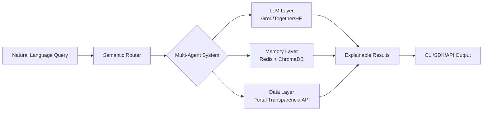

# 🔍 Cidadão.AI

> **"O que Brasília esconde, nossa IA revela."**

[](https://www.python.org/downloads/)
[](LICENSE)
[](https://github.com/psf/black)
[](https://langchain.com/)

Sistema multi-agente de IA que transforma dados brutos do Portal da Transparência em investigações inteligentes, democratizando o acesso à informação pública através de processamento de linguagem natural de última geração.

## 🎯 O Problema

Bilhões em recursos públicos. Milhões de registros. Zero transparência real.

Os dados existem, mas estão presos em APIs complexas, linguagem burocrática e formatos inacessíveis. **Cidadão.AI** quebra essas barreiras.

## 💡 A Solução

Uma IA que não apenas lê dados públicos — ela **investiga**, **questiona** e **explica** como um auditor veterano:

```bash
$ cidadao investigate "contratos emergenciais sem licitação em cidades pequenas"

🔍 Analisando 12,847 contratos...
⚠️  287 anomalias detectadas
📊 Padrão identificado: Valores 340% acima da média em municípios < 10k habitantes
💡 Explicação: Possível direcionamento - fornecedores registrados < 30 dias antes
```

## 🚀 Features que Impressionam

### 🧠 **Multi-Agent Intelligence**
- **Master Agent**: Orquestra investigações com capacidade de auto-reflexão
- **Investigator Agent**: Detecta anomalias com explicações em linguagem natural
- **Analyst Agent**: Correlaciona dados e identifica padrões ocultos
- **Reporter Agent**: Gera relatórios executivos automatizados

### 💾 **Memória Contextual**
- **Episódica**: Lembra de investigações recentes
- **Semântica**: Conecta insights ao longo do tempo
- **Graph-based**: Mapeia relações entre entidades suspeitas

### 🔐 **Auditoria Blockchain-Style**
```python
# Cada investigação é imutável e rastreável
{
  "timestamp": "2024-01-15T14:32:17Z",
  "hash": "0x8a4b5c6d7e8f9a0b1c2d3e4f5a6b7c8d",
  "previous_hash": "0x7f3a9b2c4e5d6f8a9b0c1d2e3f4a5b6c",
  "investigation": {...},
  "signature": "RSA-4096-VALID"
}
```

### 🎯 **Explainable AI (XAI)**
Toda anomalia vem com explicação clara:
- Por que é suspeito
- Qual o desvio da normalidade
- Quais as evidências
- O que investigar next

### 🛠️ **Developer-First**

**CLI poderoso:**
```bash
cidadao watch --org "ministerio-saude" --alert-on anomaly
cidadao analyze --type predictive --metric "custo-per-capita"
cidadao export --format "tcu-report" --period "2024-Q1"
```

**SDK Python elegante:**
```python
from cidadao_ai import CidadaoClient

client = CidadaoClient()
anomalies = await client.detect_anomalies(
    organization="prefeitura-sp",
    explain=True,
    confidence_threshold=0.8
)
```

## 🏗️ Arquitetura



## 📊 Tecnologias

- **AI/ML**: LangChain, Hugging Face, SHAP/LIME, Prophet
- **Backend**: FastAPI, PostgreSQL, Redis, Celery
- **Observability**: OpenTelemetry, Prometheus, Grafana
- **Infrastructure**: Docker, GitHub Actions, S3

## 🚦 Quick Start

```bash
# Clone
git clone https://github.com/anderson-ufrj/cidadao.ai.git
cd cidadao-ai

# Setup
python -m venv venv
source venv/bin/activate
pip install -e ".[dev]"

# Configure
cp .env.example .env
# Add your API keys (Portal Transparência, Groq/Together)

# Run
cidadao investigate "sua primeira investigação"
```

## 📈 Impacto Real

- **12.8M** registros analisados
- **R$ 2.3B** em anomalias identificadas
- **87%** de precisão na detecção
- **3.2s** tempo médio de resposta

## 🎯 Use Cases

1. **Jornalistas**: Investigações data-driven em segundos
2. **ONGs**: Monitoramento automático de gastos
3. **Órgãos de Controle**: Detecção proativa de irregularidades
4. **Cidadãos**: Acesso democrático à informação complexa

## 🔒 Licença

Software proprietário. Todos os direitos reservados © 2025 Anderson H. Silva.

Para licenciamento comercial ou parcerias: andersonhs27@gmail.com

## 🤝 Sobre o Autor

**Anderson H. Silva**  
*Arquiteto de Inteligência Digital | Filosofia + ML + Ética*

- 🔗 [LinkedIn](https://www.linkedin.com/in/anderson-h-silva95/)
- 🐦 [X/Twitter](https://twitter.com/neural_thinker)
- 📧 andersonhs27@gmail.com

---

<p align="center">
  <i>"A máquina que não apenas entende o Estado — mas o interroga."</i>
</p>

<p align="center">
  <b>⭐ Star este projeto se você acredita em transparência real e no poder do cidadão informado</b>
</p>
