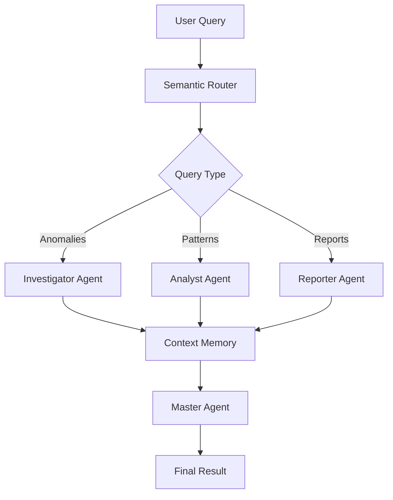

# 📋 User Manual - Cidadão.AI

**Version:** 1.0.0  
**Date:** January 2025  
**Language:** English (US)

---

## 📑 Table of Contents

1. [Overview](#-overview)
2. [Installation](#-installation)
3. [Configuration](#-configuration)
4. [Getting Started](#-getting-started)
5. [Command Line Interface (CLI)](#-command-line-interface-cli)
6. [REST API](#-rest-api)
7. [Multi-Agent System](#-multi-agent-system)
8. [Use Cases](#-use-cases)
9. [Troubleshooting](#-troubleshooting)
10. [Frequently Asked Questions](#-frequently-asked-questions)

---

## 🎯 Overview

### What is Cidadão.AI?

**Cidadão.AI** is an artificial intelligence platform specialized in public transparency analysis. The system uses an advanced multi-agent architecture to transform complex data from Brazil's Transparency Portal into intelligent investigations and comprehensive reports.

### Key Features

- **🔍 Anomaly Detection**: Identifies irregularities in contracts, expenses, and public biddings
- **📊 Pattern Analysis**: Discovers hidden trends and correlations in government data
- **📄 Report Generation**: Creates natural language reports in Markdown, HTML, and JSON formats
- **🌐 Complete REST API**: Endpoints for integration with external systems
- **⚡ Real-time Processing**: Streaming results as they are discovered
- **🔐 Robust Security**: JWT authentication, rate limiting, and comprehensive auditing

### System Architecture

Cidadão.AI is built with a microservices architecture based on specialized agents:

```
┌─────────────────┐    ┌─────────────────┐    ┌─────────────────┐
│   Frontend      │    │   REST API      │    │ Multi-Agents    │
│   (Planned)     │◄──►│   FastAPI       │◄──►│   Specialized   │
└─────────────────┘    └─────────────────┘    └─────────────────┘
                              │                        │
                              ▼                        ▼
┌─────────────────┐    ┌─────────────────┐    ┌─────────────────┐
│   Database      │    │   Transparency  │    │   LLM Providers │
│ PostgreSQL/Redis│    │   Portal API    │    │ Groq/Together   │
└─────────────────┘    └─────────────────┘    └─────────────────┘
```

### Technologies Used

- **Backend**: Python 3.11+, FastAPI, Pydantic
- **AI/ML**: LangChain, Hugging Face Transformers, SHAP/LIME
- **LLM**: Groq, Together AI, Hugging Face
- **Database**: PostgreSQL, Redis, ChromaDB
- **Authentication**: JWT, API Key
- **Observability**: Structured logging, performance metrics

---

## 🛠️ Installation

### Prerequisites

Before installing Cidadão.AI, ensure you have:

- **Python 3.11** or higher
- **Git** for version control
- **Transparency Portal API key**
- **LLM API keys** (Groq, Together AI, or Hugging Face)

### Installation via Git

```bash
# 1. Clone the repository
git clone https://github.com/anderson-ufrj/cidadao.ai.git
cd cidadao-ai

# 2. Create a virtual environment
python -m venv venv

# 3. Activate the virtual environment
# Linux/Mac:
source venv/bin/activate
# Windows:
venv\Scripts\activate

# 4. Install dependencies
pip install -e ".[dev]"

# 5. Verify installation
cidadao --version
```

### Installation via Docker

```bash
# 1. Clone the repository
git clone https://github.com/anderson-ufrj/cidadao.ai.git
cd cidadao-ai

# 2. Build Docker image
docker build -t cidadao-ai .

# 3. Run the container
docker run -p 8000:8000 \
  -e TRANSPARENCY_API_KEY=your_key_here \
  -e GROQ_API_KEY=your_groq_key \
  cidadao-ai
```

### Installation Verification

To verify successful installation:

```bash
# Test the CLI
cidadao --help

# Test the API (if configured)
curl http://localhost:8000/health
```

---

## ⚙️ Configuration

### Configuration File (.env)

Cidadão.AI uses environment variables for configuration. Copy the example file and configure your keys:

```bash
# Copy the example file
cp .env.example .env

# Edit the file with your keys
nano .env
```

### Required Environment Variables

```bash
# Transparency Portal API
TRANSPARENCY_API_KEY=your_transparency_portal_key

# LLM Providers (at least one required)
GROQ_API_KEY=your_groq_key
TOGETHER_API_KEY=your_together_ai_key
HUGGINGFACE_API_KEY=your_huggingface_key

# API Settings
JWT_SECRET_KEY=your_secret_jwt_key_here
```

### Optional Environment Variables

```bash
# Runtime environment
APP_ENV=development  # development, staging, production

# Server settings
HOST=0.0.0.0
PORT=8000
DEBUG=true

# Rate limiting settings
RATE_LIMIT_PER_MINUTE=60
RATE_LIMIT_PER_HOUR=1000
RATE_LIMIT_PER_DAY=10000

# Log settings
LOG_LEVEL=INFO  # DEBUG, INFO, WARNING, ERROR

# LLM provider URLs
GROQ_API_BASE_URL=https://api.groq.com/openai/v1
TOGETHER_API_BASE_URL=https://api.together.xyz/v1
```

### Obtaining API Keys

#### Transparency Portal

1. Visit: https://api.portaldatransparencia.gov.br/swagger-ui/index.html
2. Register in the system
3. Request an API key
4. Wait for approval (may take several days)

#### Groq

1. Visit: https://console.groq.com/
2. Create a free account
3. Generate a new API key
4. Copy the key to the .env file

#### Together AI

1. Visit: https://api.together.xyz/
2. Register on the platform
3. Access the dashboard and generate an API key
4. Configure in the .env file

#### Hugging Face

1. Visit: https://huggingface.co/
2. Create an account
3. Go to Settings → Access Tokens
4. Generate a new token
5. Configure in the .env file

### Configuration Validation

After configuring environment variables, validate the configuration:

```bash
# Test API connectivity
cidadao test-connection

# Check service status
curl http://localhost:8000/health/detailed
```

---

## 🚀 Getting Started

### 1. First Run

After installation and configuration, start the system:

```bash
# Start API server
python -m src.api.app

# Or using uvicorn directly
uvicorn src.api.app:app --reload --host 0.0.0.0 --port 8000
```

### 2. System Verification

```bash
# Check if API is working
curl http://localhost:8000/health

# Expected response:
{
  "status": "healthy",
  "timestamp": "2025-01-24T15:30:00Z",
  "version": "1.0.0",
  "uptime": 10.5
}
```

### 3. Access Interactive Documentation

Open your browser and go to:
- **Swagger UI**: http://localhost:8000/docs
- **ReDoc**: http://localhost:8000/redoc

### 4. First Investigation via CLI

```bash
# Simple investigation
cidadao investigate "suspicious emergency contracts"

# Investigation with filters
cidadao investigate "directed biddings" \
  --org "26000" \
  --year 2024 \
  --min-value 1000000
```

### 5. First Investigation via API

```bash
# Start investigation
curl -X POST "http://localhost:8000/api/v1/investigations/start" \
  -H "Content-Type: application/json" \
  -d '{
    "query": "contracts with suspicious prices",
    "data_source": "contracts",
    "anomaly_types": ["price", "vendor"]
  }'

# Response:
{
  "investigation_id": "inv-12345",
  "status": "started",
  "message": "Investigation queued for processing"
}
```

### 6. Monitor Progress

```bash
# Via API - Status
curl "http://localhost:8000/api/v1/investigations/inv-12345/status"

# Via API - Real-time streaming
curl "http://localhost:8000/api/v1/investigations/stream/inv-12345"

# Via CLI
cidadao status inv-12345
```

### 7. Get Results

```bash
# Complete results via API
curl "http://localhost:8000/api/v1/investigations/inv-12345/results"

# Via CLI
cidadao results inv-12345 --format json
```

---

## 💻 Command Line Interface (CLI)

### Main Commands

Cidadão.AI offers an intuitive and powerful command line interface:

#### Anomaly Investigation

```bash
# Basic investigation
cidadao investigate "investigation description"

# Investigation with specific filters
cidadao investigate "suspicious contracts" \
  --source contracts \
  --org "26000" \
  --year 2024 \
  --min-value 1000000 \
  --anomaly-types price,vendor,temporal

# Investigation with specific output
cidadao investigate "irregular biddings" \
  --output results.json \
  --format json \
  --explain
```

#### Pattern Analysis

```bash
# Trend analysis
cidadao analyze trends \
  --source contracts \
  --period 6months \
  --org "Ministry of Health"

# Correlation analysis
cidadao analyze correlations \
  --variables value,duration,vendor \
  --source contracts

# Pattern detection
cidadao analyze patterns \
  --type vendor \
  --source contracts \
  --org "26000"
```

#### Report Generation

```bash
# Executive report
cidadao report generate \
  --type executive_summary \
  --title "Q1 2024 Analysis" \
  --investigations inv-001,inv-002 \
  --format html

# Detailed report
cidadao report generate \
  --type detailed_analysis \
  --source contracts \
  --period "2024-01-01,2024-12-31" \
  --format markdown

# List available reports
cidadao report list --status completed
```

#### Monitoring and Status

```bash
# System status
cidadao status

# Specific investigation status
cidadao status inv-12345

# Real-time monitoring
cidadao watch --org "26000" --threshold 0.8

# System logs
cidadao logs --tail 100 --level ERROR
```

#### Configuration and Testing

```bash
# Test connectivity
cidadao test-connection

# Configure API keys
cidadao config set GROQ_API_KEY "your_key_here"

# Show current configuration
cidadao config show

# Clear cache
cidadao cache clear
```

### Global Options

```bash
# Options available for all commands
--verbose, -v        # Detailed output
--quiet, -q          # Minimal output
--config FILE        # Specific configuration file
--output FILE        # Output file
--format FORMAT      # Output format (json, yaml, table, csv)
--no-cache          # Disable cache
--timeout SECONDS   # Custom timeout
```

### Practical CLI Usage Examples

#### Complete Contract Investigation

```bash
# 1. Investigate suspicious contracts
cidadao investigate "emergency contracts in small cities" \
  --source contracts \
  --year 2024 \
  --min-value 500000 \
  --anomaly-types price,vendor \
  --output contract_investigation.json

# 2. Analyze patterns in results
cidadao analyze patterns \
  --type vendor \
  --input contract_investigation.json \
  --output vendor_patterns.json

# 3. Generate final report
cidadao report generate \
  --type investigation_report \
  --title "Suspicious Emergency Contracts - 2024" \
  --input contract_investigation.json,vendor_patterns.json \
  --format html \
  --output final_report.html
```

#### Continuous Monitoring

```bash
# Monitor anomalies in real-time
cidadao watch \
  --org "Ministry of Health" \
  --threshold 0.9 \
  --alert-email admin@company.com \
  --check-interval 3600  # Check every hour
```

---

## 🌐 REST API

### API Overview

The Cidadão.AI REST API provides programmatic access to all system functionalities. It is based on REST standards and returns data in JSON format.

**Base URL**: `http://localhost:8000`  
**Version**: `v1`  
**Interactive Documentation**: `/docs`

### Authentication

#### API Key Authentication

```bash
# Include header in all requests
curl -H "X-API-Key: your_api_key" \
  http://localhost:8000/api/v1/investigations/
```

#### JWT Authentication

```bash
# 1. Get token (login endpoint to be implemented)
TOKEN="eyJhbGciOiJIUzI1NiIsInR5cCI6IkpXVCJ9..."

# 2. Use token in requests
curl -H "Authorization: Bearer $TOKEN" \
  http://localhost:8000/api/v1/investigations/
```

### Main Endpoints

#### Health Check

```bash
# Basic status
GET /health

# Detailed status
GET /health/detailed

# Kubernetes probes
GET /health/live    # Liveness
GET /health/ready   # Readiness
```

#### Investigations

```bash
# Start investigation
POST /api/v1/investigations/start
{
  "query": "suspicious contracts",
  "data_source": "contracts",
  "filters": {"year": 2024},
  "anomaly_types": ["price", "vendor"],
  "include_explanations": true
}

# List investigations
GET /api/v1/investigations/?status=completed&limit=10

# Investigation status
GET /api/v1/investigations/{id}/status

# Complete results
GET /api/v1/investigations/{id}/results

# Real-time stream
GET /api/v1/investigations/stream/{id}

# Cancel investigation
DELETE /api/v1/investigations/{id}
```

#### Analysis

```bash
# Start analysis
POST /api/v1/analysis/start
{
  "analysis_type": "spending_trends",
  "data_source": "contracts",
  "time_range": {"start": "2024-01-01", "end": "2024-12-31"},
  "include_correlations": true
}

# Trend analysis
GET /api/v1/analysis/trends?data_source=contracts&time_period=6months

# Correlation analysis
GET /api/v1/analysis/correlations?variables=value,duration&data_source=contracts

# Pattern detection
GET /api/v1/analysis/patterns?data_source=contracts&pattern_type=vendor

# Analysis results
GET /api/v1/analysis/{id}/results
```

#### Reports

```bash
# Generate report
POST /api/v1/reports/generate
{
  "report_type": "executive_summary",
  "title": "Transparency Analysis Q1 2024",
  "data_sources": ["contracts", "expenses"],
  "investigation_ids": ["inv-001"],
  "output_format": "markdown",
  "target_audience": "executive"
}

# Available templates
GET /api/v1/reports/templates

# Get report
GET /api/v1/reports/{id}

# Download report
GET /api/v1/reports/{id}/download?format=html

# List reports
GET /api/v1/reports/?report_type=executive_summary&limit=10

# Delete report
DELETE /api/v1/reports/{id}
```

### HTTP Status Codes

- **200 OK**: Successful request
- **201 Created**: Resource created successfully
- **400 Bad Request**: Request validation error
- **401 Unauthorized**: Authentication required
- **403 Forbidden**: Access denied
- **404 Not Found**: Resource not found
- **409 Conflict**: Resource state conflict
- **429 Too Many Requests**: Rate limit exceeded
- **500 Internal Server Error**: Internal server error
- **502 Bad Gateway**: External service error
- **503 Service Unavailable**: Service temporarily unavailable

### Rate Limiting

The API implements rate limiting to prevent abuse:

- **Per minute**: 60 requests
- **Per hour**: 1,000 requests
- **Per day**: 10,000 requests

Response headers include limit information:
```
X-RateLimit-Limit-Minute: 60
X-RateLimit-Remaining-Minute: 45
X-RateLimit-Reset: 1642789200
```

### Data Streaming

For long operations, the API offers real-time streaming via Server-Sent Events:

```javascript
// JavaScript example
const eventSource = new EventSource(
  'http://localhost:8000/api/v1/investigations/stream/inv-12345'
);

eventSource.onmessage = function(event) {
  const data = JSON.parse(event.data);
  
  if (data.type === 'progress') {
    console.log(`Progress: ${data.progress * 100}%`);
  } else if (data.type === 'anomaly') {
    console.log('New anomaly found:', data.result);
  } else if (data.type === 'completion') {
    console.log('Investigation completed');
    eventSource.close();
  }
};
```

---

## 🤖 Multi-Agent System

### Agent Architecture

Cidadão.AI uses a multi-agent architecture where each agent has specific responsibilities:

#### 1. Master Agent (Orchestrator)
- **Function**: Coordinates other agents and manages workflow
- **Capabilities**: Planning, reflection, and strategy optimization
- **Usage**: Entry point for complex investigations

#### 2. Investigator Agent
- **Function**: Detects anomalies and irregularities in data
- **Capabilities**: 
  - Price anomaly detection
  - Vendor concentration identification
  - Suspicious temporal pattern analysis
  - Duplicate contract detection
- **Algorithms**: Z-score, isolation forest, outlier detection

#### 3. Analyst Agent
- **Function**: Performs statistical analysis and identifies patterns
- **Capabilities**:
  - Spending trend analysis
  - Variable correlations
  - Organizational behavioral patterns
  - Seasonal and temporal analysis
- **Methods**: Regression, clustering, time series analysis

#### 4. Reporter Agent
- **Function**: Generates natural language reports
- **Capabilities**:
  - Executive reports
  - Detailed technical analysis
  - Multiple output formats
  - Audience adaptation

#### 5. Context Memory Agent
- **Function**: Manages episodic and semantic memory
- **Capabilities**:
  - Remember previous investigations
  - Cross-session context
  - Incremental learning

#### 6. Semantic Router
- **Function**: Routes queries to appropriate agents
- **Capabilities**:
  - Intent analysis
  - Intelligent routing
  - Resource optimization

### Agent Workflow



### Inter-Agent Communication

Agents communicate through:

#### Structured Messages
```python
{
  "sender": "investigator_agent",
  "receiver": "reporter_agent",
  "message_type": "anomaly_detected",
  "payload": {
    "anomaly_id": "anom-001",
    "type": "price_anomaly",
    "confidence": 0.95,
    "data": {...}
  },
  "timestamp": "2025-01-24T15:30:00Z"
}
```

#### Shared Context
```python
{
  "conversation_id": "conv-12345",
  "user_id": "user-789",
  "session_data": {
    "investigation_focus": "emergency_contracts",
    "findings": [...],
    "context_memory": {...}
  }
}
```

### Agent Configuration

#### Code Configuration
```python
from src.agents import InvestigatorAgent, AnalystAgent

# Configure Investigator Agent
investigator = InvestigatorAgent(
    llm_provider="groq",
    confidence_threshold=0.8,
    max_anomalies=100,
    explanation_detail="high"
)

# Configure Analyst Agent
analyst = AnalystAgent(
    llm_provider="together",
    analysis_depth="comprehensive",
    correlation_threshold=0.7
)
```

#### Environment Configuration
```bash
# Investigator Agent settings
INVESTIGATOR_CONFIDENCE_THRESHOLD=0.8
INVESTIGATOR_MAX_ANOMALIES=100
INVESTIGATOR_LLM_PROVIDER=groq

# Analyst Agent settings
ANALYST_CORRELATION_THRESHOLD=0.7
ANALYST_TREND_SENSITIVITY=0.05
ANALYST_LLM_PROVIDER=together
```