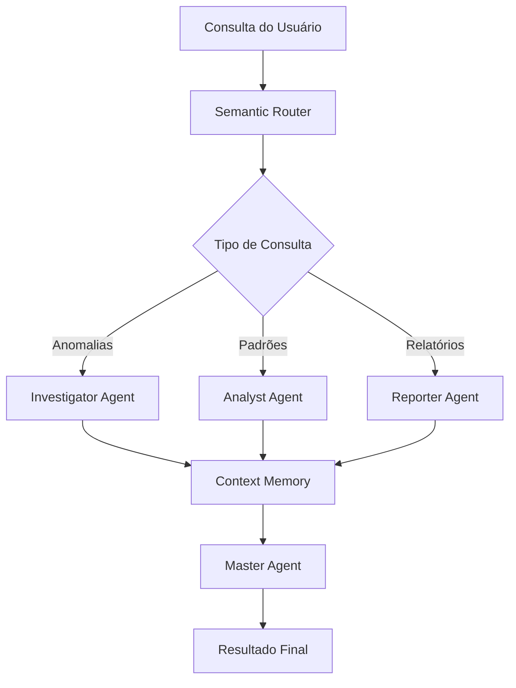

# 📋 Manual do Usuário - Cidadão.AI

**Versão:** 1.0.0  
**Data:** Janeiro 2025  
**Idioma:** Português (Brasil)

---

## 📑 Índice

1. [Visão Geral](#-visão-geral)
2. [Instalação](#-instalação)
3. [Configuração](#-configuração)
4. [Primeiros Passos](#-primeiros-passos)
5. [Interface de Linha de Comando (CLI)](#-interface-de-linha-de-comando-cli)
6. [API REST](#-api-rest)
7. [Sistema Multi-Agentes](#-sistema-multi-agentes)
8. [Casos de Uso](#-casos-de-uso)
9. [Solução de Problemas](#-solução-de-problemas)
10. [Perguntas Frequentes](#-perguntas-frequentes)

---

## 🎯 Visão Geral

### O que é o Cidadão.AI?

O **Cidadão.AI** é uma plataforma de inteligência artificial especializada em análise de transparência pública. O sistema utiliza uma arquitetura multi-agente avançada para transformar dados complexos do Portal da Transparência em investigações inteligentes e relatórios compreensíveis.

### Principais Funcionalidades

- **🔍 Detecção de Anomalias**: Identifica irregularidades em contratos, despesas e licitações públicas
- **📊 Análise de Padrões**: Descobre tendências e correlações ocultas nos dados governamentais
- **📄 Geração de Relatórios**: Cria relatórios em linguagem natural nos formatos Markdown, HTML e JSON
- **🌐 API REST Completa**: Endpoints para integração com sistemas externos
- **⚡ Processamento em Tempo Real**: Streaming de resultados conforme são descobertos
- **🔐 Segurança Robusta**: Autenticação JWT, rate limiting e auditoria completa

### Arquitetura do Sistema

O Cidadão.AI é construído com uma arquitetura de microsserviços baseada em agentes especializados:

```
┌─────────────────┐    ┌─────────────────┐    ┌─────────────────┐
│   Frontend      │    │   API REST      │    │ Multi-Agentes   │
│   (Planejado)   │◄──►│   FastAPI       │◄──►│   Specialized   │
└─────────────────┘    └─────────────────┘    └─────────────────┘
                              │                        │
                              ▼                        ▼
┌─────────────────┐    ┌─────────────────┐    ┌─────────────────┐
│   Database      │    │   Portal da     │    │   LLM Providers │
│ PostgreSQL/Redis│    │ Transparência   │    │ Groq/Together   │
└─────────────────┘    └─────────────────┘    └─────────────────┘
```

### Tecnologias Utilizadas

- **Backend**: Python 3.11+, FastAPI, Pydantic
- **IA/ML**: LangChain, Hugging Face Transformers, SHAP/LIME
- **LLM**: Groq, Together AI, Hugging Face
- **Banco de Dados**: PostgreSQL, Redis, ChromaDB
- **Autenticação**: JWT, API Key
- **Observabilidade**: Logging estruturado, métricas de performance

---

## 🛠️ Instalação

### Pré-requisitos

Antes de instalar o Cidadão.AI, certifique-se de ter:

- **Python 3.11** ou superior
- **Git** para controle de versão
- **Chave da API** do Portal da Transparência
- **Chaves das APIs** de LLM (Groq, Together AI, ou Hugging Face)

### Instalação via Git

```bash
# 1. Clone o repositório
git clone https://github.com/anderson-ufrj/cidadao.ai.git
cd cidadao-ai

# 2. Crie um ambiente virtual
python -m venv venv

# 3. Ative o ambiente virtual
# Linux/Mac:
source venv/bin/activate
# Windows:
venv\Scripts\activate

# 4. Instale as dependências
pip install -e ".[dev]"

# 5. Verifique a instalação
cidadao --version
```

### Instalação via Docker

```bash
# 1. Clone o repositório
git clone https://github.com/anderson-ufrj/cidadao.ai.git
cd cidadao-ai

# 2. Build da imagem Docker
docker build -t cidadao-ai .

# 3. Execute o container
docker run -p 8000:8000 \
  -e TRANSPARENCY_API_KEY=sua_chave_aqui \
  -e GROQ_API_KEY=sua_chave_groq \
  cidadao-ai
```

### Verificação da Instalação

Para verificar se a instalação foi bem-sucedida:

```bash
# Teste o CLI
cidadao --help

# Teste a API (se configurada)
curl http://localhost:8000/health
```

---

## ⚙️ Configuração

### Arquivo de Configuração (.env)

O Cidadão.AI utiliza variáveis de ambiente para configuração. Copie o arquivo de exemplo e configure suas chaves:

```bash
# Copie o arquivo de exemplo
cp .env.example .env

# Edite o arquivo com suas chaves
nano .env
```

### Variáveis de Ambiente Obrigatórias

```bash
# API do Portal da Transparência
TRANSPARENCY_API_KEY=sua_chave_portal_transparencia

# Provedores de LLM (pelo menos um obrigatório)
GROQ_API_KEY=sua_chave_groq
TOGETHER_API_KEY=sua_chave_together_ai
HUGGINGFACE_API_KEY=sua_chave_huggingface

# Configurações da API
JWT_SECRET_KEY=sua_chave_secreta_jwt_aqui
```

### Variáveis de Ambiente Opcionais

```bash
# Ambiente de execução
APP_ENV=development  # development, staging, production

# Configurações do servidor
HOST=0.0.0.0
PORT=8000
DEBUG=true

# Configurações de rate limiting
RATE_LIMIT_PER_MINUTE=60
RATE_LIMIT_PER_HOUR=1000
RATE_LIMIT_PER_DAY=10000

# Configurações de log
LOG_LEVEL=INFO  # DEBUG, INFO, WARNING, ERROR

# URLs dos provedores LLM
GROQ_API_BASE_URL=https://api.groq.com/openai/v1
TOGETHER_API_BASE_URL=https://api.together.xyz/v1
```

### Obtenção das Chaves de API

#### Portal da Transparência

1. Acesse: https://api.portaldatransparencia.gov.br/swagger-ui/index.html
2. Registre-se no sistema
3. Solicite uma chave de API
4. Aguarde a aprovação (pode levar alguns dias)

#### Groq

1. Acesse: https://console.groq.com/
2. Crie uma conta gratuita
3. Gere uma nova API key
4. Copie a chave para o arquivo .env

#### Together AI

1. Acesse: https://api.together.xyz/
2. Registre-se na plataforma
3. Acesse o dashboard e gere uma API key
4. Configure no arquivo .env

#### Hugging Face

1. Acesse: https://huggingface.co/
2. Crie uma conta
3. Vá para Settings → Access Tokens
4. Gere um novo token
5. Configure no arquivo .env

### Validação da Configuração

Após configurar as variáveis de ambiente, valide a configuração:

```bash
# Teste a conectividade com as APIs
cidadao test-connection

# Verificar status dos serviços
curl http://localhost:8000/health/detailed
```

---

## 🚀 Primeiros Passos

### 1. Primeira Execução

Após a instalação e configuração, inicie o sistema:

```bash
# Iniciar servidor da API
python -m src.api.app

# Ou usando uvicorn diretamente
uvicorn src.api.app:app --reload --host 0.0.0.0 --port 8000
```

### 2. Verificação do Sistema

```bash
# Verificar se a API está funcionando
curl http://localhost:8000/health

# Resposta esperada:
{
  "status": "healthy",
  "timestamp": "2025-01-24T15:30:00Z",
  "version": "1.0.0",
  "uptime": 10.5
}
```

### 3. Acessar a Documentação Interativa

Abra seu navegador e acesse:
- **Swagger UI**: http://localhost:8000/docs
- **ReDoc**: http://localhost:8000/redoc

### 4. Primeira Investigação via CLI

```bash
# Investigação simples
cidadao investigate "contratos emergenciais suspeitos"

# Investigação com filtros
cidadao investigate "licitações direcionadas" \
  --org "26000" \
  --year 2024 \
  --min-value 1000000
```

### 5. Primeira Investigação via API

```bash
# Iniciar investigação
curl -X POST "http://localhost:8000/api/v1/investigations/start" \
  -H "Content-Type: application/json" \
  -d '{
    "query": "contratos com preços suspeitos",
    "data_source": "contracts",
    "anomaly_types": ["price", "vendor"]
  }'

# Resposta:
{
  "investigation_id": "inv-12345",
  "status": "started",
  "message": "Investigation queued for processing"
}
```

### 6. Acompanhar Progresso

```bash
# Via API - Status
curl "http://localhost:8000/api/v1/investigations/inv-12345/status"

# Via API - Stream em tempo real
curl "http://localhost:8000/api/v1/investigations/stream/inv-12345"

# Via CLI
cidadao status inv-12345
```

### 7. Obter Resultados

```bash
# Resultados completos via API
curl "http://localhost:8000/api/v1/investigations/inv-12345/results"

# Via CLI
cidadao results inv-12345 --format json
```

---

## 💻 Interface de Linha de Comando (CLI)

### Comandos Principais

O Cidadão.AI oferece uma interface de linha de comando intuitiva e poderosa:

#### Investigação de Anomalias

```bash
# Investigação básica
cidadao investigate "descrição da investigação"

# Investigação com filtros específicos
cidadao investigate "contratos suspeitos" \
  --source contracts \
  --org "26000" \
  --year 2024 \
  --min-value 1000000 \
  --anomaly-types price,vendor,temporal

# Investigação com saída específica
cidadao investigate "licitações irregulares" \
  --output results.json \
  --format json \
  --explain
```

#### Análise de Padrões

```bash
# Análise de tendências
cidadao analyze trends \
  --source contracts \
  --period 6months \
  --org "Ministério da Saúde"

# Análise de correlações
cidadao analyze correlations \
  --variables valor,prazo,fornecedor \
  --source contracts

# Detecção de padrões
cidadao analyze patterns \
  --type vendor \
  --source contracts \
  --org "26000"
```

#### Geração de Relatórios

```bash
# Relatório executivo
cidadao report generate \
  --type executive_summary \
  --title "Análise Q1 2024" \
  --investigations inv-001,inv-002 \
  --format html

# Relatório detalhado
cidadao report generate \
  --type detailed_analysis \
  --source contracts \
  --period "2024-01-01,2024-12-31" \
  --format markdown

# Listar relatórios disponíveis
cidadao report list --status completed
```

#### Monitoramento e Status

```bash
# Status do sistema
cidadao status

# Status de investigação específica
cidadao status inv-12345

# Monitoramento em tempo real
cidadao watch --org "26000" --threshold 0.8

# Logs do sistema
cidadao logs --tail 100 --level ERROR
```

#### Configuração e Teste

```bash
# Testar conectividade
cidadao test-connection

# Configurar chaves de API
cidadao config set GROQ_API_KEY "sua_chave_aqui"

# Visualizar configuração atual
cidadao config show

# Limpar cache
cidadao cache clear
```

### Opções Globais

```bash
# Opções disponíveis para todos os comandos
--verbose, -v        # Saída detalhada
--quiet, -q          # Saída mínima
--config FILE        # Arquivo de configuração específico
--output FILE        # Arquivo de saída
--format FORMAT      # Formato de saída (json, yaml, table, csv)
--no-cache          # Desabilitar cache
--timeout SECONDS   # Timeout personalizado
```

### Exemplos Práticos de Uso do CLI

#### Investigação Completa de Contratos

```bash
# 1. Investigar contratos suspeitos
cidadao investigate "contratos emergenciais em cidades pequenas" \
  --source contracts \
  --year 2024 \
  --min-value 500000 \
  --anomaly-types price,vendor \
  --output investigacao_contratos.json

# 2. Analisar padrões nos resultados
cidadao analyze patterns \
  --type vendor \
  --input investigacao_contratos.json \
  --output padroes_fornecedores.json

# 3. Gerar relatório final
cidadao report generate \
  --type investigation_report \
  --title "Contratos Emergenciais Suspeitos - 2024" \
  --input investigacao_contratos.json,padroes_fornecedores.json \
  --format html \
  --output relatorio_final.html
```

#### Monitoramento Contínuo

```bash
# Monitorar anomalias em tempo real
cidadao watch \
  --org "Ministério da Saúde" \
  --threshold 0.9 \
  --alert-email admin@empresa.com \
  --check-interval 3600  # Verificar a cada hora
```

---

## 🌐 API REST

### Visão Geral da API

A API REST do Cidadão.AI fornece acesso programático a todas as funcionalidades do sistema. Ela é baseada nos padrões REST e retorna dados em formato JSON.

**Base URL**: `http://localhost:8000`  
**Versão**: `v1`  
**Documentação Interativa**: `/docs`

### Autenticação

#### Autenticação por API Key

```bash
# Incluir header em todas as requisições
curl -H "X-API-Key: sua_chave_api" \
  http://localhost:8000/api/v1/investigations/
```

#### Autenticação JWT

```bash
# 1. Obter token (endpoint de login será implementado)
TOKEN="eyJhbGciOiJIUzI1NiIsInR5cCI6IkpXVCJ9..."

# 2. Usar token nas requisições
curl -H "Authorization: Bearer $TOKEN" \
  http://localhost:8000/api/v1/investigations/
```

### Endpoints Principais

#### Health Check

```bash
# Status básico
GET /health

# Status detalhado
GET /health/detailed

# Probes do Kubernetes
GET /health/live    # Liveness
GET /health/ready   # Readiness
```

#### Investigações

```bash
# Iniciar investigação
POST /api/v1/investigations/start
{
  "query": "contratos suspeitos",
  "data_source": "contracts",
  "filters": {"ano": 2024},
  "anomaly_types": ["price", "vendor"],
  "include_explanations": true
}

# Listar investigações
GET /api/v1/investigations/?status=completed&limit=10

# Status de investigação
GET /api/v1/investigations/{id}/status

# Resultados completos
GET /api/v1/investigations/{id}/results

# Stream em tempo real
GET /api/v1/investigations/stream/{id}

# Cancelar investigação
DELETE /api/v1/investigations/{id}
```

#### Análises

```bash
# Iniciar análise
POST /api/v1/analysis/start
{
  "analysis_type": "spending_trends",
  "data_source": "contracts",
  "time_range": {"start": "2024-01-01", "end": "2024-12-31"},
  "include_correlations": true
}

# Análise de tendências
GET /api/v1/analysis/trends?data_source=contracts&time_period=6months

# Análise de correlações
GET /api/v1/analysis/correlations?variables=valor,prazo&data_source=contracts

# Detecção de padrões
GET /api/v1/analysis/patterns?data_source=contracts&pattern_type=vendor

# Resultados de análise
GET /api/v1/analysis/{id}/results
```

#### Relatórios

```bash
# Gerar relatório
POST /api/v1/reports/generate
{
  "report_type": "executive_summary",
  "title": "Análise de Transparência Q1 2024",
  "data_sources": ["contracts", "expenses"],
  "investigation_ids": ["inv-001"],
  "output_format": "markdown",
  "target_audience": "executive"
}

# Templates disponíveis
GET /api/v1/reports/templates

# Obter relatório
GET /api/v1/reports/{id}

# Download do relatório
GET /api/v1/reports/{id}/download?format=html

# Listar relatórios
GET /api/v1/reports/?report_type=executive_summary&limit=10

# Deletar relatório
DELETE /api/v1/reports/{id}
```

### Códigos de Status HTTP

- **200 OK**: Requisição bem-sucedida
- **201 Created**: Recurso criado com sucesso
- **400 Bad Request**: Erro de validação na requisição
- **401 Unauthorized**: Autenticação necessária
- **403 Forbidden**: Acesso negado
- **404 Not Found**: Recurso não encontrado
- **409 Conflict**: Conflito de estado do recurso
- **429 Too Many Requests**: Limite de taxa excedido
- **500 Internal Server Error**: Erro interno do servidor
- **502 Bad Gateway**: Erro do serviço externo
- **503 Service Unavailable**: Serviço temporariamente indisponível

### Rate Limiting

A API implementa limitação de taxa para prevenir abuso:

- **Por minuto**: 60 requisições
- **Por hora**: 1.000 requisições
- **Por dia**: 10.000 requisições

Headers de resposta incluem informações de limite:
```
X-RateLimit-Limit-Minute: 60
X-RateLimit-Remaining-Minute: 45
X-RateLimit-Reset: 1642789200
```

### Streaming de Dados

Para operações longas, a API oferece streaming em tempo real via Server-Sent Events:

```javascript
// Exemplo em JavaScript
const eventSource = new EventSource(
  'http://localhost:8000/api/v1/investigations/stream/inv-12345'
);

eventSource.onmessage = function(event) {
  const data = JSON.parse(event.data);
  
  if (data.type === 'progress') {
    console.log(`Progresso: ${data.progress * 100}%`);
  } else if (data.type === 'anomaly') {
    console.log('Nova anomalia encontrada:', data.result);
  } else if (data.type === 'completion') {
    console.log('Investigação concluída');
    eventSource.close();
  }
};
```

---

## 🤖 Sistema Multi-Agentes

### Arquitetura dos Agentes

O Cidadão.AI utiliza uma arquitetura multi-agente onde cada agente tem responsabilidades específicas:

#### 1. Master Agent (Orquestrador)
- **Função**: Coordena outros agentes e gerencia o fluxo de trabalho
- **Capacidades**: Planejamento, reflexão e otimização de estratégias
- **Uso**: Ponto de entrada para investigações complexas

#### 2. Investigator Agent (Investigador)
- **Função**: Detecta anomalias e irregularidades nos dados
- **Capacidades**: 
  - Detecção de anomalias de preço
  - Identificação de concentração de fornecedores
  - Análise de padrões temporais suspeitos
  - Detecção de contratos duplicados
- **Algoritmos**: Z-score, isolamento florestal, detecção de outliers

#### 3. Analyst Agent (Analista)
- **Função**: Realiza análises estatísticas e identifica padrões
- **Capacidades**:
  - Análise de tendências de gastos
  - Correlações entre variáveis
  - Padrões comportamentais organizacionais
  - Análise sazonal e temporal
- **Métodos**: Regressão, clustering, análise de séries temporais

#### 4. Reporter Agent (Relator)
- **Função**: Gera relatórios em linguagem natural
- **Capacidades**:
  - Relatórios executivos
  - Análises técnicas detalhadas
  - Múltiplos formatos de saída
  - Adaptação para diferentes audiências

#### 5. Context Memory Agent (Memória Contextual)
- **Função**: Gerencia memória episódica e semântica
- **Capacidades**:
  - Lembrança de investigações anteriores
  - Contexto entre sessões
  - Aprendizado incremental

#### 6. Semantic Router (Roteador Semântico)
- **Função**: Direciona consultas para agentes apropriados
- **Capacidades**:
  - Análise de intenção
  - Roteamento inteligente
  - Otimização de recursos

### Fluxo de Trabalho dos Agentes



### Comunicação Entre Agentes

Os agentes se comunicam através de:

#### Mensagens Estruturadas
```python
{
  "sender": "investigator_agent",
  "receiver": "reporter_agent",
  "message_type": "anomaly_detected",
  "payload": {
    "anomaly_id": "anom-001",
    "type": "price_anomaly",
    "confidence": 0.95,
    "data": {...}
  },
  "timestamp": "2025-01-24T15:30:00Z"
}
```

#### Contexto Compartilhado
```python
{
  "conversation_id": "conv-12345",
  "user_id": "user-789",
  "session_data": {
    "investigation_focus": "emergency_contracts",
    "findings": [...],
    "context_memory": {...}
  }
}
```

### Configuração dos Agentes

#### Configuração via Código
```python
from src.agents import InvestigatorAgent, AnalystAgent

# Configurar Investigator Agent
investigator = InvestigatorAgent(
    llm_provider="groq",
    confidence_threshold=0.8,
    max_anomalies=100,
    explanation_detail="high"
)

# Configurar Analyst Agent
analyst = AnalystAgent(
    llm_provider="together",
    analysis_depth="comprehensive",
    correlation_threshold=0.7
)
```

#### Configuração via Environment
```bash
# Configurações do Investigator Agent
INVESTIGATOR_CONFIDENCE_THRESHOLD=0.8
INVESTIGATOR_MAX_ANOMALIES=100
INVESTIGATOR_LLM_PROVIDER=groq

# Configurações do Analyst Agent
ANALYST_CORRELATION_THRESHOLD=0.7
ANALYST_TREND_SENSITIVITY=0.05
ANALYST_LLM_PROVIDER=together
```